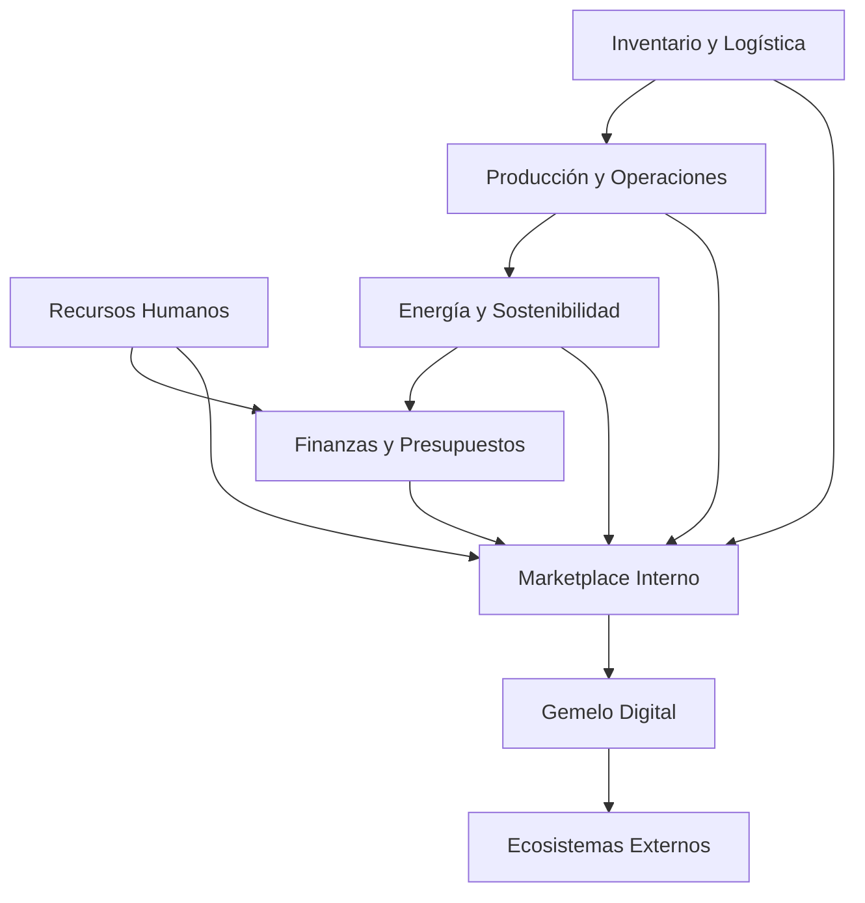
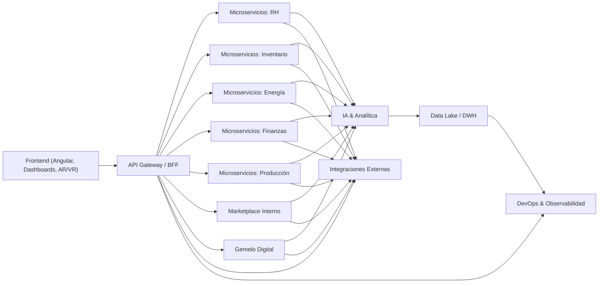
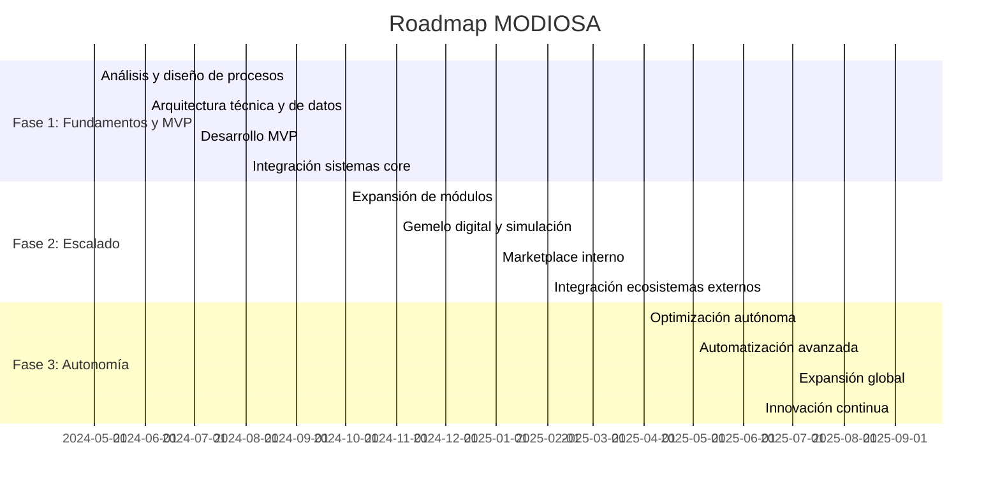
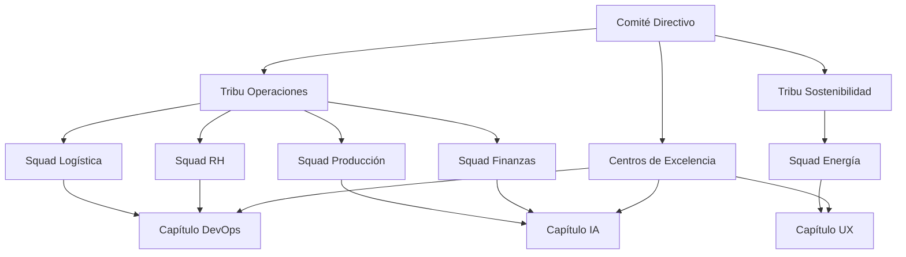
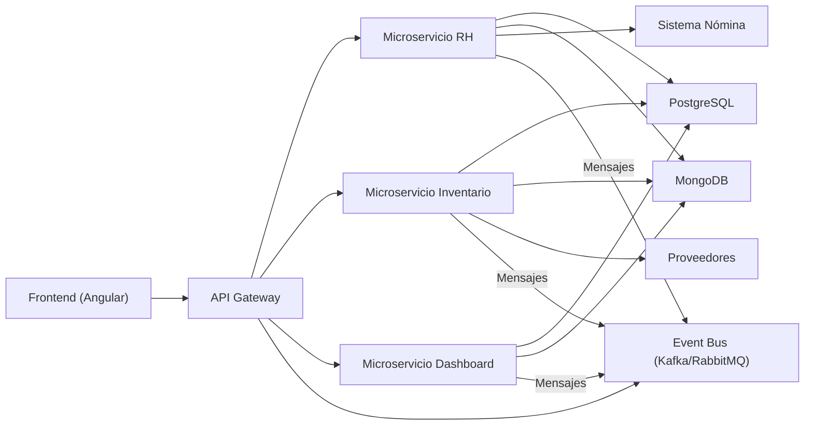

# Proyecto MODIOSA: Visión y Arquitectura Estratégica

---

## 1. Visión a Largo Plazo

Ser la plataforma digital integral líder que transforma, optimiza y conecta todos los procesos, recursos y datos de la empresa a nivel global, permitiendo innovación continua, eficiencia operativa, sostenibilidad y crecimiento exponencial.

### Detalles y Alcance de la Visión
- **Transformación Digital Total:** MODIOSA será el núcleo digital de la empresa, integrando todas las áreas (operaciones, finanzas, recursos humanos, logística, sostenibilidad, etc.) en una única plataforma.
- **Escalabilidad Global:** Diseñada para operar en múltiples países, idiomas, monedas y marcos regulatorios, soportando la expansión internacional y la gestión de múltiples unidades de negocio.
- **Innovación Continua:** La plataforma facilitará la experimentación, el aprendizaje y la adopción de nuevas tecnologías (IA, IoT, blockchain, AR/VR) para mantener a la empresa a la vanguardia.
- **Sostenibilidad y Responsabilidad Social:** MODIOSA será un habilitador clave para alcanzar objetivos ESG (ambientales, sociales y de gobernanza), midiendo y optimizando el impacto en tiempo real.
- **Autonomía Progresiva:** Evolucionará hacia la automatización y optimización autónoma de procesos, permitiendo a la empresa operar con mayor eficiencia y resiliencia.

---

## 2. Objetivos Estratégicos

1. **Optimización total de recursos**
   - Implementar algoritmos de IA y analítica avanzada para maximizar la eficiencia en el uso de recursos humanos, materiales, energéticos y financieros.
   - Ejemplo: Optimización dinámica de turnos, rutas logísticas, consumo energético y asignación presupuestaria.

2. **Integración de todas las áreas y sistemas**
   - Unificar datos y procesos de sistemas legacy (ERP, CRM, SCM, HRM, IoT) en una plataforma modular y desacoplada.
   - Ejemplo: Integración vía APIs y eventos, permitiendo interoperabilidad y visibilidad de punta a punta.

3. **Innovación continua**
   - Crear un marketplace interno donde los equipos puedan desarrollar, compartir y reutilizar automatizaciones, dashboards, algoritmos y microservicios.
   - Ejemplo: Un equipo de logística comparte un algoritmo de optimización de rutas que puede ser adoptado por otras filiales.

4. **Sostenibilidad y responsabilidad social**
   - Medir y optimizar el impacto ambiental, social y de gobernanza (ESG) en tiempo real, alineando la operación con los objetivos de sostenibilidad global.
   - Ejemplo: Módulos de monitoreo de huella de carbono y recomendaciones automáticas para reducir el consumo energético.

5. **Toma de decisiones basada en datos y simulación**
   - Implementar un gemelo digital empresarial que permita simular escenarios, predecir resultados y tomar decisiones informadas.
   - Ejemplo: Simular la apertura de una nueva planta y su impacto en la cadena de suministro antes de invertir.

6. **Escalabilidad global**
   - Preparar la plataforma para soportar millones de usuarios, múltiples regiones, unidades de negocio y normativas locales.
   - Ejemplo: Arquitectura multitenant, internacionalización (i18n), soporte para múltiples monedas y regulaciones.

7. **Seguridad y cumplimiento normativo**
   - Garantizar la protección de datos, la privacidad y el cumplimiento de normativas internacionales (GDPR, ISO, SOX, etc.).
   - Ejemplo: Implementación de autenticación robusta, auditoría, cifrado y gestión de identidades.

---

## 3. Principios Arquitectónicos

1. **Escalabilidad horizontal y vertical**
   - Uso de microservicios, contenedores (Docker, Kubernetes) y cloud para escalar componentes de forma independiente.
   - Capacidad de balanceo de carga, autoescalado y tolerancia a fallos.

2. **Arquitectura modular y desacoplada**
   - Separación clara de dominios funcionales (por ejemplo: recursos humanos, logística, finanzas, etc.) en módulos independientes.
   - Uso de monorepos (Nx) para gestionar múltiples aplicaciones y librerías compartidas.

3. **Integración vía APIs y eventos**
   - APIs REST/GraphQL para comunicación síncrona y event-driven architecture (Kafka, RabbitMQ) para procesos asíncronos.
   - Facilita la interoperabilidad con sistemas internos y externos.

4. **Data-driven y AI-first**
   - Todos los procesos y decisiones estarán fundamentados en datos, con pipelines de datos robustos y modelos de IA integrados.
   - Implementación de data lakes, data warehouses y herramientas de analítica avanzada.

5. **Seguridad y cumplimiento normativo desde el diseño**
   - Seguridad por defecto: autenticación, autorización, cifrado, monitoreo y auditoría.
   - Cumplimiento de normativas internacionales y locales desde la arquitectura.

6. **Sostenibilidad y eficiencia energética**
   - Diseño de sistemas eficientes en consumo de recursos y con capacidad de medir y optimizar el impacto ambiental.
   - Uso de cloud providers con políticas de energía renovable y optimización de cargas.

7. **Experiencia de usuario omnicanal y accesible**
   - Interfaces adaptables a web, móvil, dispositivos IoT y realidad aumentada/virtual.
   - Cumplimiento de estándares de accesibilidad (WCAG) y experiencia de usuario de clase mundial.

8. **Automatización y autonomía progresiva**
   - Automatización de procesos repetitivos y evolución hacia sistemas autónomos supervisados por humanos.
   - Integración de RPA (Robotic Process Automation) y agentes inteligentes.

9. **Observabilidad y monitoreo continuo**
   - Implementación de herramientas de logging, tracing, monitoreo de performance y alertas proactivas.
   - Ejemplo: Prometheus, Grafana, ELK Stack.

10. **Innovación y mejora continua**
    - Arquitectura preparada para incorporar nuevas tecnologías y paradigmas (serverless, edge computing, IA generativa, etc.).
    - Cultura de experimentación y aprendizaje organizacional.

---

## 4. Mapa de Procesos y Dominios Clave

El éxito de MODIOSA depende de identificar y estructurar los procesos y dominios clave de la empresa, permitiendo su integración, optimización y evolución. A continuación se detallan los principales dominios y procesos:

### 4.1. Gestión de Recursos Humanos
- Administración de turnos, ausencias, capacitación, desempeño y bienestar.
- Integración con sistemas de nómina y beneficios.
- Analítica de talento y predicción de necesidades.

### 4.2. Gestión de Inventario y Logística
- Control de inventarios en tiempo real, trazabilidad y optimización de stock.
- Planificación y optimización de rutas logísticas.
- Integración con proveedores y sistemas de transporte.

### 4.3. Optimización Energética y Sostenibilidad
- Monitoreo y análisis de consumo energético y recursos.
- Implementación de iniciativas de eficiencia y reducción de huella de carbono.
- Reportes y cumplimiento de normativas ESG.

### 4.4. Gestión Financiera y Presupuestaria
- Consolidación de datos financieros, presupuestos y proyecciones.
- Analítica avanzada para optimización de gastos e inversiones.
- Integración con sistemas contables y bancarios.

### 4.5. Producción y Operaciones
- Monitoreo y control de procesos productivos.
- Optimización de líneas de producción y mantenimiento predictivo.
- Integración con sistemas MES y SCADA.

### 4.6. Marketplace Interno de Soluciones
- Plataforma para compartir, descubrir y reutilizar automatizaciones, algoritmos y microservicios.
- Fomento de la innovación y colaboración entre áreas.

### 4.7. Simulación y Gemelo Digital Empresarial
- Creación de réplicas virtuales de procesos, recursos y operaciones.
- Simulación de escenarios y predicción de resultados.
- Herramientas de visualización avanzada (dashboards 3D, AR/VR).

### 4.8. Integración con Ecosistemas Externos
- APIs abiertas para conectar con proveedores, clientes, partners y startups.
- Intercambio seguro de datos y co-innovación.

#### Diagrama de Dominios Clave



---

## 5. Boceto de Arquitectura de Alto Nivel

La arquitectura de MODIOSA está diseñada para soportar la integración, escalabilidad y evolución continua de todos los dominios y procesos empresariales.

### 5.1. Capas Principales
- **Presentación:** Angular (monorepo Nx), Angular Material, dashboards avanzados (WebGL/Three.js), apps móviles y AR/VR.
- **Servicios de Aplicación:** Node.js/NestJS, microservicios, GraphQL/REST, orquestación de procesos, autenticación y autorización.
- **Capa de IA y Analítica:** Python, TensorFlow, scikit-learn, pipelines de datos, modelos de predicción y optimización.
- **Integración y Eventos:** APIs, event bus (Kafka/RabbitMQ), conectores ERP/CRM/IoT, integración con Digital Twin Frameworks.
- **Datos:** PostgreSQL, MongoDB, BigQuery, data lakes, data warehouses.
- **DevOps y Observabilidad:** Docker, Kubernetes, CI/CD, Prometheus, Grafana, ELK Stack, seguridad y monitoreo.
- **Sostenibilidad:** Módulos de medición y optimización ESG.

### 5.2. Arquitectura de Microservicios y Modularidad
- Cada dominio clave se implementa como un conjunto de microservicios independientes, permitiendo despliegue, escalado y evolución autónoma.
- Uso de monorepo para compartir librerías y componentes entre equipos.

### 5.3. Integración y APIs
- APIs abiertas y documentadas (OpenAPI/Swagger, GraphQL Playground).
- Event-driven architecture para procesos asíncronos y desacoplados.

#### Diagrama de Arquitectura de Alto Nivel



---

## 6. Roadmap de Fases Iniciales

El roadmap está diseñado para construir una base sólida, escalar progresivamente y habilitar la autonomía y la innovación continua.

### Fase 1: Fundamentos Estratégicos y MVP
- **Análisis y diseño detallado de procesos y dominios clave.**
- **Diseño y despliegue de la arquitectura técnica y de datos.**
- **Desarrollo del MVP:**
  - Panel de control unificado (dashboard central)
  - Integración básica de recursos humanos, inventario y energía
  - Primeros módulos de IA para predicción y optimización
  - Integración con sistemas core (ERP, HR, IoT)
- **Definición de KPIs y métricas de éxito.**

### Fase 2: Escalado y Optimización
- **Expansión de módulos:** logística, finanzas, producción, sostenibilidad.
- **Implementación de gemelo digital y simulación avanzada.**
- **Despliegue del marketplace interno de soluciones y automatizaciones.**
- **Integración con ecosistemas externos (proveedores, partners, clientes).**
- **Mejora continua de IA y analítica avanzada.**

### Fase 3: Autonomía y Transformación
- **Optimización autónoma basada en IA generativa.**
- **Automatización de procesos complejos y toma de decisiones autónoma supervisada.**
- **Expansión global y multitenant.**
- **Innovación continua y aprendizaje organizacional.**
- **Evolución hacia nuevas tecnologías (serverless, edge computing, AR/VR, blockchain).**

#### Diagrama de Roadmap



---

## 7. KPIs y Métricas de Éxito

El éxito de MODIOSA debe medirse con indicadores claros, alineados a los objetivos estratégicos y revisados periódicamente para asegurar la evolución y el impacto a gran escala.

### 7.1. KPIs Operativos y de Negocio
- **Reducción de costos operativos:**
  - % de ahorro en recursos humanos, materiales, energía y logística.
- **Incremento de eficiencia y productividad:**
  - % de mejora en tiempos de ciclo, producción, entregas y resolución de incidencias.
- **Nivel de integración y automatización:**
  - % de procesos integrados y automatizados respecto al total.
- **Satisfacción de usuarios y stakeholders:**
  - NPS (Net Promoter Score), encuestas de satisfacción, tasa de adopción.
- **Impacto en sostenibilidad y ESG:**
  - Reducción de huella de carbono, consumo energético, cumplimiento de normativas ESG.
- **Tiempo de adopción y escalado:**
  - Tiempo desde el despliegue hasta la adopción masiva en cada área o país.
- **Innovación y reutilización interna:**
  - Número de automatizaciones, algoritmos y microservicios compartidos y reutilizados en el marketplace interno.

### 7.2. KPIs Técnicos
- **Disponibilidad y resiliencia:**
  - % de uptime, tiempo medio entre fallos (MTBF), tiempo medio de recuperación (MTTR).
- **Performance y escalabilidad:**
  - Latencia promedio, throughput, capacidad de escalar usuarios y transacciones.
- **Seguridad y cumplimiento:**
  - Número de incidentes de seguridad, auditorías exitosas, cumplimiento de normativas (GDPR, ISO, etc.).
- **Calidad del software:**
  - Cobertura de tests, bugs críticos en producción, velocidad de despliegue (CI/CD).

### 7.3. Mecanismos de Seguimiento
- **Dashboards ejecutivos y operativos** con visualización en tiempo real de KPIs clave.
- **Revisiones periódicas** (mensuales, trimestrales) con stakeholders y equipos técnicos.
- **Alertas y notificaciones** automáticas ante desvíos críticos.
- **Cultura de mejora continua** basada en datos y feedback.

---

## 8. Gobierno y Cultura

La gobernanza y la cultura organizacional son fundamentales para el éxito y la sostenibilidad de un proyecto de esta magnitud.

### 8.1. Gobierno del Proyecto
- **Estructura de equipos multidisciplinarios y ágiles:**
  - Squads por dominio (RH, logística, finanzas, etc.), tribus por áreas estratégicas, centros de excelencia en IA, datos y automatización.
- **Modelos de gobierno claros y adaptativos:**
  - Comité directivo, Product Owners, arquitectos empresariales y técnicos, responsables de seguridad y cumplimiento.
- **Toma de decisiones basada en datos:**
  - Uso de KPIs y analítica para priorizar, ajustar y validar iniciativas.
- **Gestión de riesgos y compliance:**
  - Identificación, seguimiento y mitigación de riesgos técnicos, operativos y regulatorios.

### 8.2. Cultura Organizacional
- **Innovación y aprendizaje continuo:**
  - Programas de formación, hackathons internos, incentivos a la experimentación y la mejora.
- **Colaboración y transparencia:**
  - Herramientas colaborativas, comunicación abierta, documentación accesible y compartida.
- **Gestión del cambio y adopción:**
  - Planes de formación, acompañamiento y comunicación para facilitar la adopción y minimizar la resistencia.
- **Reconocimiento y motivación:**
  - Programas de reconocimiento a equipos y personas que impulsen la innovación, la eficiencia y la cultura digital.

### 8.3. Mecanismos de Gobierno y Cultura
- **Rituales ágiles:**
  - Dailys, reviews, retrospectivas, PI plannings.
- **Comunidades de práctica:**
  - Grupos internos de expertos en IA, DevOps, UX, sostenibilidad, etc.
- **Feedback 360°:**
  - Encuestas, sesiones de feedback cruzado, buzón de ideas y sugerencias.
- **Transparencia y comunicación ejecutiva:**
  - Reportes periódicos a la alta dirección y a toda la organización sobre avances, retos y logros.

---

## 9. Procesos Operativos y Estructura de Equipos

### 9.1. Procesos Operativos Clave

#### a) Gestión de la Demanda y Priorización
- Proceso para recibir, analizar y priorizar nuevas iniciativas, mejoras y requerimientos de negocio o tecnología.
- Comité de priorización con representantes de negocio, tecnología y arquitectura.
- Herramientas: Backlog centralizado, tableros Kanban, sesiones de grooming.

#### b) Ciclo de Vida de Desarrollo (SDLC)
- Metodología ágil (Scrum/Kanban) para la entrega continua de valor.
- Sprints de 2-3 semanas, entregas incrementales y revisiones frecuentes.
- Integración continua (CI), despliegue continuo (CD) y automatización de pruebas.

#### c) Gestión de la Calidad y Seguridad
- Definición de estándares de calidad, revisiones de código, cobertura de tests y auditorías de seguridad.
- Automatización de análisis estático, pruebas de performance y compliance.

#### d) Gestión del Cambio y Adopción
- Planes de formación, comunicación y acompañamiento para usuarios finales y equipos técnicos.
- Estrategias de gestión del cambio para minimizar la resistencia y maximizar la adopción.

#### e) Soporte y Mejora Continua
- Mesa de ayuda y soporte de segundo/tercer nivel para incidentes y problemas.
- Proceso de feedback y mejora continua basado en KPIs y encuestas de satisfacción.

#### f) Gestión de Proveedores y Partners
- Proceso de evaluación, integración y seguimiento de proveedores tecnológicos y partners estratégicos.
- Contratos, SLAs y mecanismos de co-innovación.

---

### 9.2. Estructura de Equipos para Gran Escala

#### a) Equipos Multidominio (Squads)
- Cada dominio clave (RH, logística, finanzas, producción, etc.) cuenta con un squad dedicado, responsable de todo el ciclo de vida del producto en su área.
- Composición típica: Product Owner, Tech Lead, desarrolladores frontend/backend, QA, Data/AI Engineer, UX/UI, DevOps.

#### b) Tribus y Capítulos
- Tribus: Agrupan varios squads que trabajan en áreas relacionadas (por ejemplo, "Operaciones" o "Sostenibilidad").
- Capítulos: Grupos transversales de expertos en una disciplina (DevOps, IA, UX, seguridad) que comparten mejores prácticas y estándares.

#### c) Centros de Excelencia
- Equipos especializados en IA, datos, automatización, arquitectura y seguridad.
- Proveen soporte, mentoring y aceleran la adopción de nuevas tecnologías.

#### d) Comité Directivo y Gobierno
- Comité de dirección con representantes de negocio, tecnología, arquitectura y compliance.
- Responsable de la visión, estrategia, priorización y gestión de riesgos.

#### e) Dinámicas de Trabajo
- Ceremonias ágiles: dailys, plannings, reviews, retrospectivas.
- PI Planning (Program Increment) para sincronizar objetivos y entregas a nivel global cada trimestre.
- Comunidades de práctica y hackathons internos para fomentar la innovación y el aprendizaje.

---

### 9.3. Ejemplo Visual de Estructura de Equipos



---

**Este documento es la base para la toma de decisiones, el diseño detallado y la ejecución del proyecto MODIOSA a gran escala.** 

---

## 10. Planificación de la Gestión del Cambio y la Adopción

La gestión del cambio es fundamental para asegurar la adopción exitosa y sostenible de MODIOSA en toda la organización, minimizando la resistencia y maximizando el valor generado.

### 10.1. Fases de la Gestión del Cambio

1. **Preparación y Diagnóstico**
   - Evaluación de la cultura organizacional, nivel de madurez digital y posibles resistencias.
   - Identificación de stakeholders clave y mapeo de impacto por área.
   - Definición de objetivos de cambio y métricas de éxito.

2. **Comunicación y Sensibilización**
   - Campañas de comunicación interna sobre la visión, beneficios y roadmap de MODIOSA.
   - Charlas, webinars y materiales visuales para explicar el "por qué" y el "para qué" del cambio.
   - Identificación y empoderamiento de embajadores del cambio en cada área.

3. **Formación y Capacitación**
   - Programas de formación adaptados a cada rol (usuarios finales, líderes, equipos técnicos).
   - Laboratorios prácticos, e-learnings, talleres y sesiones de preguntas y respuestas.
   - Materiales de autoayuda y documentación accesible.

4. **Acompañamiento y Soporte**
   - Mesa de ayuda dedicada y canales de soporte multicanal.
   - Equipos de acompañamiento en campo durante los primeros despliegues.
   - Feedback continuo y ajustes rápidos ante dudas o problemas.

5. **Consolidación y Mejora Continua**
   - Medición de la adopción y satisfacción mediante KPIs y encuestas.
   - Celebración de logros y reconocimiento a equipos y personas destacadas.
   - Incorporación de feedback para iterar y mejorar procesos y herramientas.

---

### 10.2. Estrategias y Acciones Clave

- **Stakeholder Engagement:** Involucrar a líderes y usuarios clave desde el inicio, asegurando su participación activa en el diseño y despliegue.
- **Comunicación Transparente:** Mantener informada a toda la organización sobre avances, retos y próximos pasos.
- **Formación Personalizada:** Adaptar la capacitación a los distintos perfiles y niveles de madurez digital.
- **Pilotos y Despliegue Progresivo:** Iniciar con pilotos controlados, aprender y escalar gradualmente.
- **Reconocimiento e Incentivos:** Premiar la adopción, la innovación y la colaboración.
- **Gestión de la Resistencia:** Identificar focos de resistencia y abordarlos con empatía, escucha activa y soluciones concretas.

---

### 10.3. Roles Involucrados

- **Sponsor Ejecutivo:** Impulsa la visión y asegura el apoyo de la alta dirección.
- **Equipo de Gestión del Cambio:** Lidera la estrategia, la comunicación y la formación.
- **Embajadores del Cambio:** Referentes en cada área que facilitan la adopción y canalizan feedback.
- **Usuarios Finales:** Participan activamente en la formación, pruebas y mejora continua.
- **Mesa de Ayuda y Soporte:** Responde dudas, resuelve incidentes y recopila sugerencias.

---

### 10.4. Mecanismos de Seguimiento y Medición

- **KPIs de Adopción:** Tasa de uso, participación en formaciones, satisfacción de usuarios, reducción de incidencias.
- **Encuestas y Feedback:** Medición periódica de percepción, barreras y oportunidades de mejora.
- **Reportes Ejecutivos:** Informes regulares a la dirección sobre el avance y los logros del proceso de cambio.
- **Círculos de Mejora:** Espacios periódicos para compartir aprendizajes y ajustar la estrategia.

--- 

---

## 11. Plantillas de Comunicación para la Gestión del Cambio

### 11.1. Anuncio Inicial del Proyecto

**Asunto:** ¡Comienza la transformación digital con MODIOSA!

**Cuerpo:**
> Estimado equipo,
>
> Nos complace anunciar el inicio de MODIOSA, la nueva plataforma digital que transformará la forma en que trabajamos, colaboramos y creamos valor en nuestra empresa. MODIOSA integrará todos nuestros procesos clave, potenciará la innovación y nos permitirá alcanzar nuevos niveles de eficiencia y sostenibilidad.
>
> En las próximas semanas, compartiremos más información sobre los beneficios, el roadmap y cómo puedes participar en este emocionante viaje.
>
> ¡Contamos contigo para construir el futuro juntos!
>
> Atentamente,
> [Sponsor Ejecutivo]

---

### 11.2. Invitación a Formación y Talleres

**Asunto:** ¡Participa en la capacitación de MODIOSA!

**Cuerpo:**
> Hola [Nombre],
>
> Te invitamos a participar en las sesiones de formación sobre MODIOSA, donde aprenderás a sacar el máximo provecho de la nueva plataforma. Habrá talleres prácticos, materiales interactivos y espacios para resolver todas tus dudas.
>
> Consulta el calendario y regístrate en las sesiones que mejor se adapten a tu agenda.
>
> ¡Tu participación es clave para el éxito de este cambio!
>
> Saludos,
> Equipo de Gestión del Cambio

---

### 11.3. Reconocimiento y Celebración de Logros

**Asunto:** ¡Felicitaciones por un hito clave en MODIOSA!

**Cuerpo:**
> ¡Enhorabuena equipo!
>
> Gracias a su dedicación y esfuerzo, hemos alcanzado un hito importante en la adopción de MODIOSA. Su compromiso y actitud positiva han sido fundamentales para este logro.
>
> Seguimos avanzando juntos hacia una empresa más innovadora, eficiente y sostenible.
>
> ¡Sigamos construyendo el futuro!
>
> Dirección General

---

## 12. Ejemplos de KPIs de Adopción y Planificación de Pilotos

### 12.1. Ejemplos de KPIs de Adopción

- **Tasa de uso activo:** % de usuarios que utilizan MODIOSA al menos una vez por semana.
- **Participación en formaciones:** % de empleados que completan los módulos de capacitación.
- **Satisfacción de usuarios:** Puntuación promedio en encuestas post-despliegue (>80% satisfacción).
- **Reducción de incidencias:** Disminución del número de tickets/incidencias relacionados con procesos migrados a MODIOSA.
- **Tiempo de adopción:** Días promedio desde el despliegue hasta el uso regular por parte de cada área.
- **Número de embajadores activos:** Cantidad de referentes que participan activamente en la gestión del cambio.
- **Feedback positivo:** % de sugerencias y comentarios positivos recibidos sobre la plataforma.

---

### 12.2. Planificación de Pilotos y Despliegue Progresivo

1. **Selección de áreas piloto:**
   - Elegir áreas representativas y con alto impacto para los primeros despliegues (por ejemplo, Recursos Humanos y Logística).
   - Involucrar a líderes y embajadores desde el inicio.

2. **Definición de objetivos y métricas para el piloto:**
   - Establecer KPIs claros de éxito y mecanismos de feedback.

3. **Despliegue controlado:**
   - Implementar MODIOSA en las áreas piloto, acompañando con formación y soporte dedicado.
   - Monitorear el uso, recopilar feedback y resolver incidencias rápidamente.

4. **Evaluación y ajuste:**
   - Analizar resultados, identificar mejoras y ajustar procesos/formación antes de escalar.

5. **Escalado progresivo:**
   - Ampliar el despliegue a nuevas áreas y regiones, aplicando las lecciones aprendidas.
   - Mantener la comunicación, formación y soporte continuo.

6. **Consolidación y mejora continua:**
   - Medir la adopción global, celebrar logros y seguir iterando sobre la base del feedback y los KPIs.

--- 

---

## 13. Selección de Módulos para el MVP

### 13.1. Criterios de Selección
- Alto impacto en la operación y valor para el negocio.
- Representatividad de procesos clave y escalabilidad futura.
- Facilidad de integración con sistemas existentes.
- Potencial para demostrar beneficios rápidos y medibles.
- Capacidad de servir como base para otros módulos futuros.

### 13.2. Módulos Seleccionados para el MVP

1. **Gestión de Recursos Humanos (RH)**
   - Administración de turnos, ausencias y desempeño.
   - Analítica básica de talento y predicción de necesidades.
   - Integración con nómina y sistemas de beneficios.

2. **Gestión de Inventario y Logística**
   - Control de inventarios en tiempo real y optimización de stock.
   - Planificación y seguimiento de rutas logísticas.
   - Integración con proveedores y sistemas de transporte.

3. **Panel de Control Unificado (Dashboard Central)**
   - Visualización de KPIs operativos y de negocio.
   - Acceso a reportes y analítica básica de los módulos anteriores.

---

## 14. Casos de Uso y Requerimientos del MVP

### 14.1. Gestión de Recursos Humanos (RH)

**Casos de Uso Principales:**
- Registrar y gestionar turnos y ausencias de empleados.
- Visualizar el calendario de turnos y ausencias por área/equipo.
- Generar reportes de asistencia y desempeño.
- Integrar datos con nómina y beneficios.

**Requerimientos Funcionales:**
- CRUD de turnos y ausencias.
- Gestión de usuarios y roles (empleado, supervisor, RRHH).
- Notificaciones automáticas de cambios y aprobaciones.
- Exportación de reportes en PDF/Excel.

**Requerimientos Técnicos:**
- Integración con sistemas de nómina vía API.
- Seguridad y control de acceso por roles.
- Soporte para múltiples ubicaciones y zonas horarias.

---

### 14.2. Gestión de Inventario y Logística

**Casos de Uso Principales:**
- Registrar y actualizar inventario en tiempo real.
- Visualizar niveles de stock y alertas de reposición.
- Planificar y asignar rutas logísticas para entregas.
- Integrar con proveedores y sistemas de transporte.

**Requerimientos Funcionales:**
- CRUD de productos, ubicaciones y movimientos de inventario.
- Gestión de órdenes de reposición y alertas automáticas.
- Visualización de rutas y seguimiento de entregas.
- Integración con proveedores vía API.

**Requerimientos Técnicos:**
- Sincronización en tiempo real de datos de inventario.
- Seguridad y trazabilidad de movimientos.
- Escalabilidad para múltiples almacenes y centros de distribución.

---

### 14.3. Panel de Control Unificado (Dashboard Central)

**Casos de Uso Principales:**
- Visualizar KPIs clave de RH e Inventario/Logística.
- Acceder a reportes y analítica básica.
- Configurar alertas y notificaciones personalizadas.

**Requerimientos Funcionales:**
- Dashboards personalizables por usuario/rol.
- Visualización gráfica de datos (charts, tablas, mapas).
- Exportación de reportes y KPIs.

**Requerimientos Técnicos:**
- Integración con los módulos de RH e Inventario.
- Seguridad y control de acceso.
- Soporte para dispositivos móviles y web.

--- 

---

## 15. Arquitectura Técnica del MVP

### 15.1. Estructura General

- **Frontend:**
  - Aplicación Angular (monorepo Nx) con módulos para RH, Inventario/Logística y Dashboard.
  - Angular Material para UI, gráficos y tablas.
  - Comunicación con backend vía REST/GraphQL.
  - Autenticación y autorización basada en JWT/OAuth2.

- **Backend:**
  - Node.js/NestJS como framework principal.
  - Microservicios independientes para RH, Inventario/Logística y Dashboard.
  - API Gateway para centralizar autenticación, logging y rate limiting.
  - Comunicación entre microservicios vía REST y event bus (Kafka/RabbitMQ).
  - Integración con sistemas externos (nómina, proveedores) vía adaptadores/API connectors.

- **Base de Datos:**
  - PostgreSQL para datos transaccionales (empleados, inventario, movimientos, etc.).
  - MongoDB para almacenamiento de logs, auditoría y datos no estructurados.

- **DevOps y Observabilidad:**
  - Docker para contenerización de servicios.
  - Kubernetes para orquestación y escalabilidad.
  - CI/CD con pipelines automatizados.
  - Monitoreo con Prometheus y Grafana.

### 15.2. Componentes Principales

- **Frontend:**
  - Módulo RH: gestión de turnos, ausencias, reportes.
  - Módulo Inventario: gestión de productos, stock, rutas.
  - Módulo Dashboard: visualización de KPIs y reportes.

- **Backend:**
  - Microservicio RH: lógica de negocio, integración con nómina.
  - Microservicio Inventario: lógica de inventario, integración con proveedores.
  - Microservicio Dashboard: agregación de datos y generación de reportes.
  - API Gateway: autenticación, autorización, logging.
  - Event Bus: mensajería entre servicios y para integración futura.

### 15.3. Integración y Seguridad

- **Autenticación y autorización centralizada** (JWT/OAuth2, roles y permisos).
- **APIs documentadas** (OpenAPI/Swagger, GraphQL Playground).
- **Auditoría y trazabilidad** de todas las operaciones críticas.
- **Encriptación de datos sensibles** en tránsito y en reposo.

### 15.4. Diagrama de Arquitectura Técnica del MVP



--- 

---

## 16. Modelado de Datos y Contratos de API del MVP

### 16.1. Modelado de Datos

#### a) Gestión de Recursos Humanos (RH)

**Entidades principales:**
- Empleado (id, nombre, email, puesto, área, ubicación, estado, fecha_ingreso)
- Turno (id, empleado_id, fecha, hora_inicio, hora_fin, tipo, estado)
- Ausencia (id, empleado_id, fecha_inicio, fecha_fin, motivo, estado)
- ReporteAsistencia (id, empleado_id, periodo, horas_trabajadas, ausencias, desempeño)

**Relaciones:**
- Un Empleado puede tener muchos Turnos y Ausencias.
- Un ReporteAsistencia se genera por Empleado y periodo.

#### b) Gestión de Inventario y Logística

**Entidades principales:**
- Producto (id, nombre, sku, categoría, stock_actual, stock_min, ubicación_id)
- Ubicación (id, nombre, tipo, dirección)
- MovimientoInventario (id, producto_id, tipo, cantidad, fecha, usuario_id, origen, destino)
- OrdenReposición (id, producto_id, cantidad, estado, fecha_creación, proveedor_id)
- RutaLogística (id, nombre, fecha, origen, destino, estado, entregas[])

**Relaciones:**
- Un Producto pertenece a una Ubicación.
- Un Producto puede tener muchos Movimientos y Órdenes de Reposición.
- Una RutaLogística puede tener muchas Entregas.

#### c) Dashboard Central

- No requiere entidades propias, sino agregaciones y vistas sobre las entidades anteriores.

---

### 16.2. Contratos de API (REST/GraphQL)

#### a) Recursos Humanos (RH)

- **GET /empleados** — Listar empleados
- **POST /empleados** — Crear empleado
- **GET /empleados/{id}** — Detalle de empleado
- **PUT /empleados/{id}** — Actualizar empleado
- **DELETE /empleados/{id}** — Eliminar empleado

- **GET /turnos?empleado_id=** — Listar turnos de un empleado
- **POST /turnos** — Crear turno
- **PUT /turnos/{id}** — Actualizar turno
- **DELETE /turnos/{id}** — Eliminar turno

- **GET /ausencias?empleado_id=** — Listar ausencias
- **POST /ausencias** — Registrar ausencia
- **PUT /ausencias/{id}** — Actualizar ausencia
- **DELETE /ausencias/{id}** — Eliminar ausencia

- **GET /reportes-asistencia?periodo=** — Reportes de asistencia por periodo

#### b) Inventario y Logística

- **GET /productos** — Listar productos
- **POST /productos** — Crear producto
- **GET /productos/{id}** — Detalle de producto
- **PUT /productos/{id}** — Actualizar producto
- **DELETE /productos/{id}** — Eliminar producto

- **GET /ubicaciones** — Listar ubicaciones
- **POST /ubicaciones** — Crear ubicación

- **GET /movimientos?producto_id=** — Movimientos de inventario
- **POST /movimientos** — Registrar movimiento

- **GET /ordenes-reposicion** — Listar órdenes de reposición
- **POST /ordenes-reposicion** — Crear orden de reposición
- **PUT /ordenes-reposicion/{id}** — Actualizar orden

- **GET /rutas-logisticas** — Listar rutas
- **POST /rutas-logisticas** — Crear ruta
- **PUT /rutas-logisticas/{id}** — Actualizar ruta

#### c) Dashboard Central

- **GET /dashboard/kpis** — Obtener KPIs agregados
- **GET /dashboard/reportes** — Obtener reportes y analítica

#### d) Seguridad y Autenticación

- **POST /auth/login** — Login de usuario
- **POST /auth/refresh** — Refrescar token
- **GET /auth/me** — Obtener perfil de usuario

---

### 16.3. Ejemplo de Esquema GraphQL (fragmento)

```graphql
# Empleado
 type Empleado {
   id: ID!
   nombre: String!
   email: String!
   puesto: String
   area: String
   ubicacion: Ubicacion
   estado: String
   fechaIngreso: String
   turnos: [Turno]
   ausencias: [Ausencia]
 }

 type Turno {
   id: ID!
   empleado: Empleado
   fecha: String
   horaInicio: String
   horaFin: String
   tipo: String
   estado: String
 }

 type Query {
   empleados: [Empleado]
   empleado(id: ID!): Empleado
   turnos(empleadoId: ID): [Turno]
   productos: [Producto]
   dashboardKPIs: DashboardKPIs
 }
```

--- 